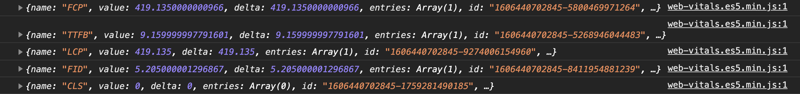
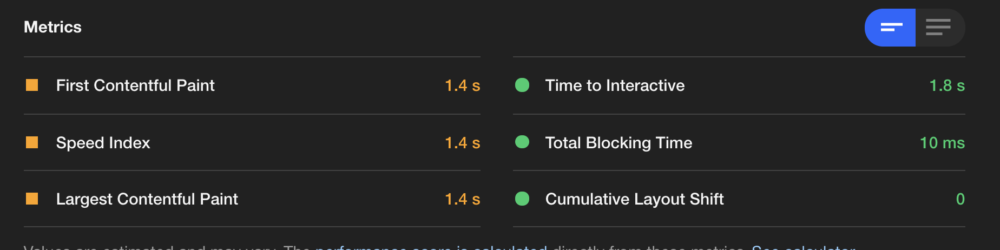
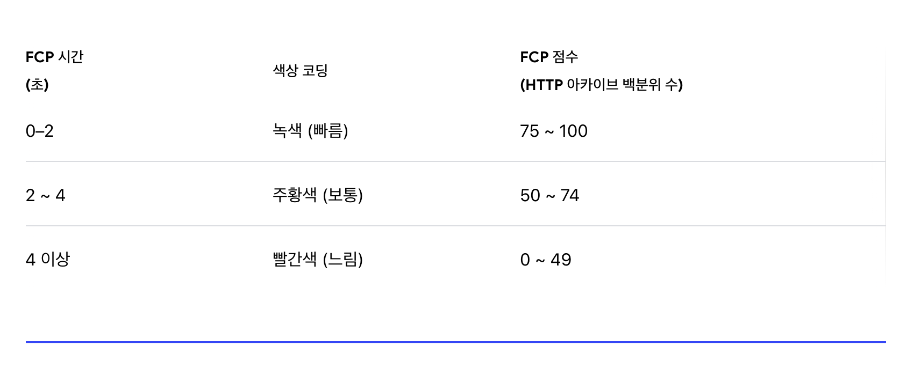
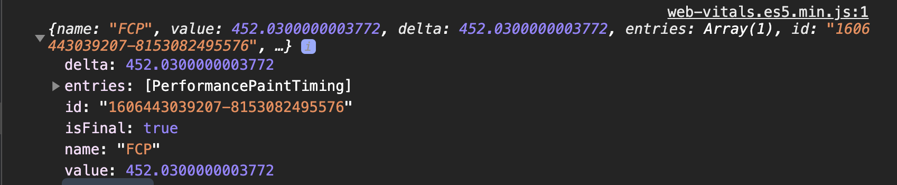
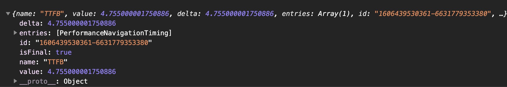

# Web Vitals

## Written By Sangheon Kim (ksj8367@gmail.com)

`web-vitals`

`LightHouse`


> 눈으로 봤을 때 차이가 심한것 같지만, 한번 일단 알아보자...

### FCP (First Contentful Paint) - Chrome Only

- TTFB 이후 콘텐츠(HTML code, CSS, Image 등)가 표시될때까지의 시간
- 사용자가 해당 이트가 동작한다고 인지시켜주기에 가장 중요한 시간.(사용자 이탈률이 줄어든다.)
- `canvas`나 `svg`는 DOM 컨텐츠로 간주한다. iframe내부 내용은 포함되지 않는다.
- LightHouse에서나 pagespeend Insights(페이지 속도 측정 도구)에서는 FCP 측정을 첫번째로 한다.

`구글 라이트하우스 에서 점수 측정 기준표`


- 초록색이 좋은것이고, 빨간색이 느린거니, 자신의 사이트를 진단해보고 최적화를 시행해보자

#### `최적화 방법`

- 데이터를 압축해준다.(정적 File들 HTML, CSS 등의 데이터들)
- 방법: https://varvy.com/pagespeed/enable-compression.html
- HTTP/2 사용

  - HTTP1.1은 연결당 하나의 요청과 응답을 처리 한다.
  - HTTP 2.0
    - 한 얀걀미디 여러개의 메시지를 동시에 주고받을 수 있다.
    - 요청 리소스마다 의존관계를 설정 해준다.
    - HTML 문서에 필요한 요청을 클라이언트 요청에 관계없이 보내줄 수 있다.
    - Header 정보를 HPACK 압축 방식을 활용하여, 압축 전송이 가능하다.

- 렌더링 차단 리소스를 제거

  - JS 파일들에 중요하지 않거나 영향이 없다면 async, defer 사용
  - `async`
    - 페이지와 완전히 독립적으로 동작한다. 백그라운드에서 다운로드 되어, HTML 페이지 내의 콘텐츠들을 처리하고 출력.
    - async 스크립트가 실행 중에는 HTML 파싱을 멈춘다.
    - `DOMContentLoaded` 이벤트와 async 이벤트는 기다리지 않는다.
    - async 스크립트들이 여러개 있으면, 비동기 방식이기에, 서로 다른 스크립트에 영향을 안줘서 다운로드가 끝난 스크립트 순으로 실행되어, 예기치 않은 동작이 발생할 수도 있으니, 주의해서 사용하자.
  - `defer`
    - 백그라운드에서 다운로드한다. 그래서 Html 파싱을 멈추지 않는다.
    - 페이지 구성이 모두 끝나면 그때 다운받은 스크립트를 실행한다.

  ```html
  <link rel="stylesheet" href="/Content/Large.css" disabled="disabled" />
  <script defer src="./sangheon.js"></script>
  <script async src="./sangheon.js"></script>
  ```

  - CSS 파일들중에 사용하지 않는 파일들에 대해서는 disabled 사용 후에 렌더되었을때
  - DOMContentLoaded 이벤트 뒤에 해당 link태그를 풀어주는것도 좋은방법이겠지만, 실제로 사용해보지는 않았다.. 해보고 독자분들이 이야기해주시면 감사감사(\_\_)
  - 리로드할 필요가 없는 자원들에 대해서는 컨텐츠를 캐싱처리하자
  - 코드 경량화 (minify) - min.js, min.css 등의 파일들을 많이들 보았을 것이다.
  - 코드 스플리팅 (이 설명은 아마 자신이 쓰고있는 프레임워크나 라이브러리에 방법이 기술되어 있을 것이다.)
  - 라이브러리들을 필요에 맞춰서 정리하자.



- 출처
- https://web.dev/first-contentful-paint/
- https://web.dev/render-blocking-resources/
- https://medium.com/@shlee1353/http1-1-vs-http2-0-%EC%B0%A8%EC%9D%B4%EC%A0%90-%EA%B0%84%EB%8B%A8%ED%9E%88-%EC%82%B4%ED%8E%B4%EB%B3%B4%EA%B8%B0-5727b7499b78 (HTTP1.1 vs HTTP2.0)

### TTFB(Time to first byte) - 사파리, 파이어 폭스, 크롬, 엣지 모두 가능

- 브라우저가 서버에서 데이터의 첫번째 바이트를 받기 전에 기다려야하는 시간을 측정한 것.
- 더쉽게 이야기하면, 사용자가 웹사이트를 서버로 요청하면, HTTP 요청에 걸리는 시간 + 서버의 요청 처리 시간 + 서버에서 클라이언트까지의 응답 시간
- lightHouse에서는 해당 시간을 건너뛴다.

#### `최적화 방법`

- 1. 호스팅 업체 변경
  - 주 타겟국이나 지역을 대상으로 리전을 변경해준다.
- 2. CDN 사용
  - 정적 파일들을 CDN에 넣는 방식인것으로 보인다.
- 3. 프리미엄 DNS rhdrmqwk tkdyd
  - 무료 DNS를 사용하는 경우 보다, Amazon Route 53과 같은 유료 DNS를 사용하는 것이 거의 3분의 1가량 시간 차이가 있는것을 볼 수 있었다.

##### 서버에 요청

- TTFB의 원래 계산에는 항상 네트워크 대기 시간이 포함된다.
- 느린 `DNS 조회 시간`은 요청 시간 증가에 영향을 미친다. 클라이언트가 해당 웹서버보다 멀리 떨어져 있는 경우 라우팅 시간이 늘어난다.

##### 서버 처리 (서버 사이드 렌더링의 경우 해당일듯하다.) - 서버에서 처리 하고 내려준다는 것을 의미하는 것.

- 요청이 전송된 후 요청을 처리하고 응답을 생성해야 하는데, 이로 인해 느린 데이터베이스 호출과 외부 서드 파티 라이브러리가 많다면 첫번쨰 응답을 캐싱하지 않는다. 잘못 최적화된 코드나 Wordpress 테마, 디스크I/O나 메모리와 같은 비효율적인 서버 리소스 같은 지연이 발생할 수 있다.

##### 클라이언트에 대한 응답

- 서버에서 처리한 응답 결과를 클라이언트가 보내게 되면, `서버와 클라이언트의 네트워크 속도` 모든것에 영향을 받는다. 클라이언트가 느린 인터넷을 사용하는 경우도 전부 TTFB에 반영된다.



- 출처
  - https://soojae.tistory.com/41
  - https://kinsta.com/blog/ttfb/

### LCP

### FID

### CLS

## 팀장님 과제 목록

- 자동화 해서 LCP 데이터를 누적할 수 있을지?
-
- LCP 수치 외 어떤 데이터를 모을 수 있는건지
-
