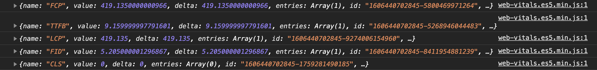
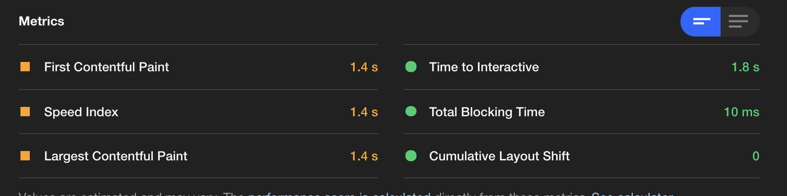
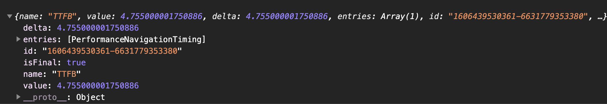

# Web Vitals

- 팀장님이 과제를 주셨다... web-vitals 모듈을 가지고, Nate, NateOn 서비스 마다 있는 랜딩 페이지들에 통계를 자동화하게끔 web-vitals 모듈을 사용해서 해보라는 과제다.
- 작업에 들어가기에 앞서 먼저 web-vitals의 종류별로 정리를 먼저 해보자는 생각이 들었다.

`web-vitals 모듈 기준 설명 입니다.`

## Written By Sangheon Kim (ksj8367@gmail.com)

`web-vitals`

`LightHouse`


> 눈으로 봤을 때 차이가 심한것 같지만, 한번 일단 알아보자...

## FCP (First Contentful Paint) - Chrome Only

> 콘솔에 찍히는 이미지를 한번 보자
> 

- TTFB 이후 콘텐츠(HTML code, CSS, Image 등)가 표시될때까지의 시간
- 사용자가 해당 이트가 동작한다고 인지시켜주기에 가장 중요한 시간.(사용자 이탈률이 줄어든다.)
- `canvas`나 `svg`는 DOM 컨텐츠로 간주한다. iframe내부 내용은 포함되지 않는다.
- LightHouse에서나 pagespeend Insights(페이지 속도 측정 도구)에서는 FCP 측정을 첫번째로 한다.

`구글 라이트하우스 에서 점수 측정 기준표`


- 초록색이 좋은것이고, 빨간색이 느린거니, 자신의 사이트를 진단해보고 최적화를 시행해보자

### `최적화 방법`

- 데이터를 압축해준다.(정적 File들 HTML, CSS 등의 데이터들)
- 방법: https://varvy.com/pagespeed/enable-compression.html
- HTTP/2 사용

  - HTTP1.1은 연결당 하나의 요청과 응답을 처리 한다.
  - HTTP 2.0
    - 한 얀걀미디 여러개의 메시지를 동시에 주고받을 수 있다.
    - 요청 리소스마다 의존관계를 설정 해준다.
    - HTML 문서에 필요한 요청을 클라이언트 요청에 관계없이 보내줄 수 있다.
    - Header 정보를 HPACK 압축 방식을 활용하여, 압축 전송이 가능하다.

- 렌더링 차단 리소스를 제거

  - JS 파일들에 중요하지 않거나 영향이 없다면 async, defer 사용
  - `async`
    - 페이지와 완전히 독립적으로 동작한다. 백그라운드에서 다운로드 되어, HTML 페이지 내의 콘텐츠들을 처리하고 출력.
    - async 스크립트가 실행 중에는 HTML 파싱을 멈춘다.
    - `DOMContentLoaded` 이벤트와 async 이벤트는 기다리지 않는다.
    - async 스크립트들이 여러개 있으면, 비동기 방식이기에, 서로 다른 스크립트에 영향을 안줘서 다운로드가 끝난 스크립트 순으로 실행되어, 예기치 않은 동작이 발생할 수도 있으니, 주의해서 사용하자.
  - `defer`
    - 백그라운드에서 다운로드한다. 그래서 Html 파싱을 멈추지 않는다.
    - 페이지 구성이 모두 끝나면 그때 다운받은 스크립트를 실행한다.

  ```html
  <link rel="stylesheet" href="/Content/Large.css" disabled="disabled" />
  <script defer src="./sangheon.js"></script>
  <script async src="./sangheon.js"></script>
  ```

  - CSS 파일들중에 사용하지 않는 파일들에 대해서는 disabled 사용 후에 렌더되었을때
  - DOMContentLoaded 이벤트 뒤에 해당 link태그를 풀어주는것도 좋은방법이겠지만, 실제로 사용해보지는 않았다.. 해보고 독자분들이 이야기해주시면 감사감사(\_\_)
  - 리로드할 필요가 없는 자원들에 대해서는 컨텐츠를 캐싱처리하자
  - 코드 경량화 (minify) - min.js, min.css 등의 파일들을 많이들 보았을 것이다.
  - 코드 스플리팅 (이 설명은 아마 자신이 쓰고있는 프레임워크나 라이브러리에 방법이 기술되어 있을 것이다.)
  - 라이브러리들을 필요에 맞춰서 정리하자.


- 출처
- https://web.dev/first-contentful-paint/
- https://web.dev/render-blocking-resources/
- https://medium.com/@shlee1353/http1-1-vs-http2-0-%EC%B0%A8%EC%9D%B4%EC%A0%90-%EA%B0%84%EB%8B%A8%ED%9E%88-%EC%82%B4%ED%8E%B4%EB%B3%B4%EA%B8%B0-5727b7499b78 (HTTP1.1 vs HTTP2.0)

## TTFB(Time to first byte) - 사파리, 파이어 폭스, 크롬, 엣지 모두 가능

> 콘솔에 찍히는 이미지를 먼저 보자
> 

- 브라우저가 서버에서 데이터의 첫번째 바이트를 받기 전에 기다려야하는 시간을 측정한 것.
- 더쉽게 이야기하면, 사용자가 웹사이트를 서버로 요청하면, HTTP 요청에 걸리는 시간 + 서버의 요청 처리 시간 + 서버에서 클라이언트까지의 응답 시간
- lightHouse에서는 해당 시간을 건너뛴다.

### `최적화 방법`

- 1. 호스팅 업체 변경
  - 주 타겟국이나 지역을 대상으로 리전을 변경해준다.
- 2. CDN 사용
  - 정적 파일들을 CDN에 넣는 방식인것으로 보인다.
- 3. 프리미엄 DNS rhdrmqwk tkdyd
  - 무료 DNS를 사용하는 경우 보다, Amazon Route 53과 같은 유료 DNS를 사용하는 것이 거의 3분의 1가량 시간 차이가 있는것을 볼 수 있었다.

#### 서버에 요청

- TTFB의 원래 계산에는 항상 네트워크 대기 시간이 포함된다.
- 느린 `DNS 조회 시간`은 요청 시간 증가에 영향을 미친다. 클라이언트가 해당 웹서버보다 멀리 떨어져 있는 경우 라우팅 시간이 늘어난다.

#### 서버 처리 (서버 사이드 렌더링의 경우 해당일듯하다.) - 서버에서 처리 하고 내려준다는 것을 의미하는 것.

- 요청이 전송된 후 요청을 처리하고 응답을 생성해야 하는데, 이로 인해 느린 데이터베이스 호출과 외부 서드 파티 라이브러리가 많다면 첫번쨰 응답을 캐싱하지 않는다. 잘못 최적화된 코드나 Wordpress 테마, 디스크I/O나 메모리와 같은 비효율적인 서버 리소스 같은 지연이 발생할 수 있다.

#### 클라이언트에 대한 응답

- 서버에서 처리한 응답 결과를 클라이언트가 보내게 되면, `서버와 클라이언트의 네트워크 속도` 모든것에 영향을 받는다. 클라이언트가 느린 인터넷을 사용하는 경우도 전부 TTFB에 반영된다.



- 출처
  - https://soojae.tistory.com/41
  - https://kinsta.com/blog/ttfb/

## LCP(Largetst Contentful paint) - 크롬 브라우저에서만 감지 가능, 초기 로드가 아닌 사용자의 클릭이든 키다운등의 이벤트 발생시 콘솔에 찍힌다.

> 우선 콘솔 이미지를 보자.
> 

- FCP는 사용자 경험을 위한 로딩 페이지나 스플래스 화면이 표시되는 그런 시간도 포함되기에, 정말 내가 전달하고 싶은 컨텐츠 영역이 표시되는 시간이 진짜 전달된 시간이 아닐까 생각해본다.
- 내가 진짜 클라이언트에게 보여주고싶은 페이지를 보여주는 시간까지의 시간을 의미한다.

`스플래시 화면`

- 앱이 실행되기전에 로딩 대체화면과 비슷한 느낌의 화면으로 생각하면 편하다<br />
   

`로딩 화면`

대표적으로 로딩화면은 뭐가좋을까 고민하던중에...? React안에 lazy Load와 코드스플리팅을 하게되면 사용자 경험을 위해서 Suspense를 통해서 로딩중에 띄워줄 UI를 넣어준다. 그런것들도 로딩 페이지가 될 수 있다.

`네이트온 빙고 프로모션 당시 사용자 경험 향상을 위한 Fallback UI를 위한 로딩 컴포넌트`

 <br />

- 네이트온의 마스코트 미로가 잠시 기다려달라고 말하는것처럼 사용자에게 조금만 기다려달라 말한다. 100분도 기다려줄 수 있을 것 같다.

- 자 여기서 이제 스플래시 화면이랑 로딩화면을 보여줬으니, 이 로딩화면이랑 스플래시 화면을 띄워지는데까지 걸리는 시간이 FCB인것이다.

### 그래서 LCP가 뭔데?


> 크롬에서 색깔의 기준을 보여준 이미지다. 2.5초 안에는 렌더링 되어야 Good한 페이지라고하고, 4초가 넘는 요소가 있다면 그건 POOR한 페이지인 것이다. 결국 최종적으로 모든 컨텐츠 요소가 다표시되는 시간이 2.5초안으로 들어와야 너는 최고야라고 말해주는것이다.

- 실제 뷰포트에서 볼수 있는 가장 큰 `이미지나 텍스트 블록`의 렌더링 시간을 보고하는 것이다.
- 마치 이게 제일 오래걸렸어 줄일 수 있으면 더줄여봐하고 해당 컨텐츠를 알려주고, 걸린시간을 알려준다..
- 위에 콘솔이 찍힌걸로봐서 아래 이미지 중에서 HBoard라고 써진 3번 헤드라인 태그로 기술한 엘리먼트를 제일 늦게 그려졌고, 427.49ms가 걸렸다고 한다.
  

### LCP 검사에 고려되는 요소

- img
- image Element 안에 svg element
- video 태그 요소
- url()통해 로드된 배경 이미지가 있는 엘리먼트
- 텍스트 노드나 기타 인라인 수준의 텍스트 요소 자식을 포함하는 블록 엘리먼트
- 100\*100 이미지를 50\*50 요소에 넣었고, 화면에 더 작게 표시되어 짤리는 경우에는, 화면에 표시되는 크기만 보고하고, 더 큰 크기로 확장하여 늘리는 경우에는 원본이미지의 기본 사이즈만큼만 보고한다.
- 텍스트노드는 해당 텍스트노드의 크기만 보고한다.

### 요소 레이아웃 및 크기 변경처리

- 처음에 화면 밖에서 렌더링 된 다음 화면에서 전환된 이미지는 보고가 안될 수 있다. 결국 화면에 표시된 초기 크기와 위치만 고려한다는 내용이다.
- 요소가 제거되거나 이미지 리소스 변경시에는 고려 대상에서 제거된다.


> 이미지 출처 : https://web.dev/lcp/

- 사진에서 보이는 것처럼 고려 요소를 기준부터 LCP 타임이 측정된다고 보면된다.

### LCP에 영향을 미치는 요소

- 느린 서버 응답 시간.
- 렌더링 차단하는 JS나 CSS(방안이나 설명은 FCP에서 설명)
- 리소스 로드 시간
- 클라이언트 사이드 렌더링

### `최적화 방법`

- `REPL 패턴으로 즉시 로딩 적용`

  - 중요한 리소스에 대해서는 preload를 수행하여 준다.

  ```html
  <link rel="preload" as="style" href="css/style.css" />
  ```

  - <a href="https://web.dev/apply-instant-loading-with-prpl/" target="_blank">자세히 보기</a>

- `주요 렌더링 경로 최적화`

  - 사용자 작업과 관련된 콘텐츠 표시의 우선순위를 지정해준다.HTML, CSS 자바스크립트 바이트 수신 후 렌더링된 픽셀로 변환처리까지, 그 사이에 포함된 중간 단계에서 어떠한 일이 일어나는지 파악만 하면된다.
    
    > 이미지 출처: https://developers.google.com/web/fundamentals/performance/critical-rendering-path
    - <a href="https://developers.google.com/web/fundamentals/performance/critical-rendering-path">자세히 보기</a>

- `CSS 최적화`

  - 
  - <a href="https://web.dev/fast/#optimize-your-css">자세히 보기</a>

- `WebFont 최적화`
- 
- <a href="https://web.dev/fast/#optimize-webfonts">자세히 보기</a>

- `Javascript 최적화(클라이언트 사이드 렌더링 용)`
- 
- <a href="https://web.dev/fast/#optimize-your-javascript">자세히 보기</a>

`FCP에서 포함된 내용도 당연히 해두는 것이 좋다. 그와 더불어서 추가로 최적화 방법을 소개한 것이다.`

- 출처
  - https://web.dev/lcp/
  - https://web.dev/apply-instant-loading-with-prpl/
  - https://developers.google.com/web/fundamentals/performance/critical-rendering-path/

## FID (First Input Delay) - Chrome에서만 감지 (사용자가 마우스다운 또는, 키다운 등의 이벤트액션을 취할떄 로그에 찍힌다. 마우스 휠 또는 스크롤 이벤트에는 반응안한다.)

- 사용자가 페이지와 처음 상호작용하는 시간이다. 혹시라도 동기적으로 실행되는 작업때문에 사용자가 클라이언트와 상호작용을 못하고 있다고 가정하는 전제하로 측정해보는것이다.
- 자바스크립트가 파싱하고 실행하는동안 너무 바쁘게 돌아가서 다른작업이 수행이 안되면 이벤트 리스너가 실행되지 않기 때문에 그 시간을 측정해보는 것이다.
- 보통 첫번째 입력 지연은 `FCP(First Contentful Paint)와 TTI(Time to Interactive) 사이에 발생한다.`

### `최적화 방법`

- 다른 회사의 코드를 감소시키는 것이다. (예를들어 광고와 같은 서드파티 코드들이다)
- Jaascript 실행 시간 단축
- 메인 스레드 작업 최소화
- 요청 수를 줄이고 전송 크기를 작게 유지

https://web.dev/optimize-fid/ - 최적화 방법 제대로 보기

- 출처
  - https://web.dev/fid/

## CLS (Cumulative Layout Shift)

- 아무런 경고 없이 손가락이 닿기 직전에 링크가 이동해서 다른 것을 클릭하게되는 상황이 생길 수 있는데, 이런 경우에 손실을 입힐 수도 있다.
- 영상을 보기전에 쉼호흡해보자... 와 이거보고 정말 가슴으로 펑펑 울었다..
  
- 사용자가 읽다가 모르고 버튼을 눌렀는데, 주문을 눌렀는데.... 취소가 되지않아 주문이 되어버리는 아우 상상만해도 가슴아프다.
- 드래그하면서 잘읽고 있다가 갑자기 install 하라는 레이아웃이 떠버려서 사용자가 주문을 해버리는 안타까운 상황이다.

### CLS란 무엇인가?

- 
- 레이아웃 변화가 가시 요소가 하나의 렌더링된 프레임에서 다음에 그 위치를 언제든지 발생시키는것을 의미한다.
- 하지만 위에 설명과는 유사하지만, 필자가 측정했을 떄는 사용자가 다른 탭으로 이동하거나 새로고침되어 다시 렌더링 될때 CLS가 찍히는것을 보았다..
- 이부분은 좀더 공부해보고 연구해보고 정확하게 전달해야 할 것 같다.

## 팀장님 과제 목록

- 자동화 해서 LCP 데이터를 누적할 수 있을지?
-
- LCP 수치 외 어떤 데이터를 모을 수 있는건지
-
