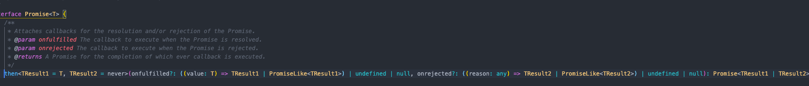

```ts
// then 타입
then<TResult1 = T, TResult2 = never>(onfulfilled?: ((value: T) => TResult1 | PromiseLike<TResult1>) | undefined | null, onrejected?: ((reason: any) => TResult2 | PromiseLike<TResult2>) | undefined | null): Promise<TResult1 | TResult2>;
```
